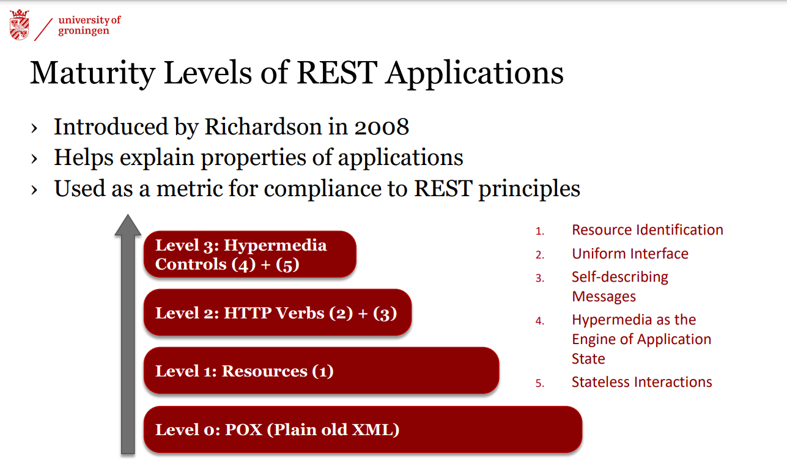
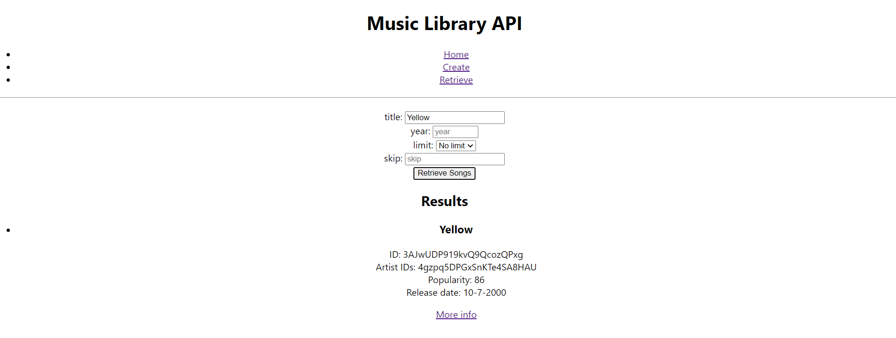

<h1 align="center">
  <a href="https://rug.nl"></a>
</h1>

Below you will find a discussion on the design and implementation of our project for the Web Engineering course at the University of Groningen. We were tasked to build a web app that allows users to search for songs and artists and view information about them. The app allows users to create, update, and delete songs and artists. It also allow users to view the top songs and artists for a given year.

# Milestones

## M1: API Design

<p align="center">
  <a href="https://swagger.io"></a>
</p>

For the first milestone as required we designed and documented our RESTful API. We did this using [Swagger](https://swagger.io) and the accompanying OpenAPI specification. We also created a mock server using SwaggerHub. The API is documented in the [spec.yml](backend/spec.yml) file and has the following functionalities:

* Retrieving, creating, updating, or deleting all information for a specific song by its unique ID
* Retrieving all songs with a given name, or none if there is no song with this name or no name was provided
* Retrieving or deleting all songs for a specific artist by artist ID or artist name
* Retrieving summary information (number of songs, earliest and latest release by date, highest popularity among all songs) for a specific artist by artist ID or artist name
* Retrieving a list of the top N, N > 1 songs by popularity for a given year, returned in batches of M = {10, 20, 50, 100}
* Retrieving a list of the top N, N > 1 artists by popularity for a given year, returned in batches of M = {10, 20, 50, 100}

## M2: API Implementation

<p align="center">
  <a href="https://nestjs.org"></a>
</p>

### NestJS

For our backend we decided to use [NestJS](https://nestjs.org), a framework for building efficient, scalable [Node.js](https://nodejs.org) server-side applications. Additional reasons to use the platform include:

* Having good documentation
* Improvements on the [Express](https://expressjs.com) framework like dependency injection
* Approachable syntax and structure, thanks to our experience with Java
* Provides a powerful CLI tool for generating and scaffolding code, making development faster and more efficient

All of these reasons made us choose NestJS as our backend framework. Moreover another point why we ended up choosing NestJS is because of its good seperation of concerns. In fact, NestJS is built on the principles of separation of concerns, which promotes the separation of different aspects of the application into distinct, modular components. This makes it easy to manage and maintain the codebase, and also improves code reusability.

One way in which NestJS achieves separation of concerns is through the use of services and controllers.

<p align="center">
  <a href="https://docs.nestjs.com/controllers" target="blank"></a>
</p>

Services are responsible for handling business logic and data processing, while controllers are responsible for handling the incoming requests and returning the appropriate responses. This separation allows for a clear division of responsibilities, making it easy to understand and maintain the codebase.

For example, a service may handle the process of creating and saving a new user to a database, while a controller may handle the process of handling a request to create a new user, validating the request data, and calling the appropriate service method. This separation allows for easy testing, as each component can be tested independently.

In addition, services can be easily shared across different controllers, further increasing code reusability. This helps to keep the controllers lean and focused on handling requests, while the services handle the heavy lifting of processing data.

Overall, the separation of concerns achieved by using services and controllers in NestJS makes the codebase more maintainable, testable and scalable.

### Database

<p align="center">
  <a href="https://postgresql.org"></a>
  <a href="https://prisma.io"></a>
  </a>
</p>

For our database setup we decided to go with [PostgreSQL](https://postgresql.org) with [Prisma](https://prisma.io) as our ORM. This was because of the following reasons:

* PostgreSQL is a powerful and feature-rich open-source relational database that is well-suited for handling complex data and large workloads
* Prisma is a modern data access layer that provides a powerful and intuitive API (Prisma studio) for interacting with databases
* Prisma provides a powerful migration system that allows you to evolve your database schema in a safe and predictable way

### Summary

<p align="center">
  <a href="https://insomnia.rest/"></a>
</p>

With these tools we were able to implement all of the functionalities that we had designed in M1. We learnt a lot as this was all our first experience with any kind of web development. Using many tools initially was intimidating. In order to do a lot of the testing for our backend we initially just ran it on localhost in one our browsers. We also used Insomnia to test non GET endpoints.

We also dabbled with Docker and `docker compose`. We were able to get a docker-compose file working that would run our frontend, backend and database with one terminal command.

## M3 Frontend Implementation

<p align="center">
  <a href="https://reactjs.org"></a>
  </a>
</p>

We decided to go with [React](https://reactjs.org) for our frontend. This was because of the following reasons:

* React is a component-based framework, which makes it easy to build reusable components that can be shared across different pages
* React has tons of community support, which makes it easy to find solutions to common problems
* Because React is so popular it also has so many libraries that are available for it. This makes it easy to add features to our application without having to reinvent the wheel

Maybe most importantly is simply the popularity of React which will help us get the 💸 in the future.

### Dockerisation

<p align="center">
  <a href="https://docker.com"></a>
  </a>
</p>

We separated the tiers of our application using [docker](https://docker.com). As a result anyone can simply clone the repo and run the following command to get the application running:

```bash
docker compose up
```

Wait until the application has started up and you should be able to access the application on <http://localhost:3001>.

## Distribution of Work

<p align="center">
  
</p>

The distribution of work among us was as follows:

* **M1** - All team members worked on this together
* **M2** - Matan did most of the initial backend including initial docker/prisma setup, Jasper finished and refined backend
* **M3** - Jasper and Alex handled most of the frontend, Jasper led the dockerisation of the application with some help from Matan

## Discussion on our REST API Maturity level

<p align="center">
  
</p>

When analyzing what level our REST api falls into it easy to see that is level 2 at the very least. This is because we use:
* Resource identification through URIs
* Uniform interface with correct use of HTTP methods
* Self-descriptive messages

The self descriptive messages might require a bit more discussion. Self descriptive messages means that the messages that are exchanged between the client and server contain all of the information necessary for the client to understand the message and the state of the request. This includes information such as the type of request being made and the format of the data being sent. This allows for a more flexible and decoupled communication between the client and server, as the client does not need to rely on any external documentation or configuration to understand the messages. 

With the following code snippet it is also clear that we are using self descriptive messages. The response contains the status code, the message and the data. This allows the client to understand the status of the request and the data that is being sent back.

```typescript
private sendResponse(res, accept: string, data: any) {
    if (accept == 'text/csv') {
      res.header('Content-Type', 'text/csv');
      res.send(parse(data));
    } else {
      res.send(data);
    }
  }

```
As can be seen in the code snippet above we have a method to check what type of response the client wants so we can always deliver a response it can easily understand i.e. self describing messages. Hence it's clear our REST API is at least level 2.

We pretty match do a kind of content-type swapping as can be seen in the scientific diagram below.
<p align="center">
  
</p>

Now when checking if is our REST api could be considered for level 3 we need to see that it adheres to the following HATEOAS (Hypermedia as the engine of application state). HATEOAS is a principle of RESTful web architecture that states that a client can navigate through the application's state by following hypermedia links, rather than having to construct URLs or make arbitrary HTTP requests.

In practical terms this means that the server includes links (dynamically generated based on initial response) to other resources in the responses it sends to the client, and the client can use these links to discover and navigate to other parts of the application.

Knowing these facts we can see that we've also adhered to HATEOAS in our application this can be seen in the following pictures of our application.

<p align="center">
  
  <br>
  <br>
  
</p>

As can be seen in the pictures above we have a link to the more info page of Yellow. This link is dynamically generated based on the initial response. This allows the client to navigate through the application's state by following hypermedia links, rather than having to construct URLs or make arbitrary HTTP requests.

Furthermore we also adhere to stateless interactions as we don't store any client state like sessions or cookies on the server. This means that the server does not need to keep track of the state of the client. This allows for a more scalable and fault tolerant application as the server does not need to keep track of the state of the client.

Therefore we can conclude that our REST API is level 3.

<p align="center">
  
</p>

```
Darth Vader: Join me, and together we can rule the galaxy with your level 3 REST API.

Luke Skywalker/Us: I'll never join you, our API was made for jedis only not for sith scum like you.

Darth Vader: You underestimate my power.

-- Luke Skywalker/Us and Darth Vader fight, Vader proceeds to use some despicable tactics --
```
<p align="center">
  
</p>


# So let us ask you...

<p align="center">
  
</p>
